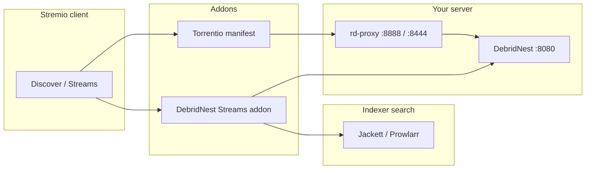

# Torrentio + DebridNest setup

Use DebridNest as a **Real-Debrid-compatible** backend with [Torrentio](https://torrentio.strem.fun/) or the **DebridNest Streams** Stremio addon. This guide covers the **rd-proxy** service that lets Torrentio-style clients talk to your self-hosted DebridNest instead of `api.real-debrid.com`.

> DebridNest is **not affiliated** with Real-Debrid or Torrentio. The proxy exists for API compatibility only.

## Architecture



**Torrentio flow:** Torrentio finds torrents from public indexers, then calls the Real-Debrid REST API to cache and unrestrict links. **rd-proxy** intercepts those API calls and forwards them to DebridNest with your token injected.

**DebridNest Streams flow:** The bundled addon searches via Jackett/Prowlarr and resolves magnets directly against DebridNest — no rd-proxy required. See [stremio-setup.md](stremio-setup.md).

## 1. Start DebridNest and rd-proxy

```bash
cp .env.example .env
# Set DEBRIDNEST_API_TOKEN and DEBRIDNEST_PUBLIC_URL
docker compose --profile torrentio up -d --build
```

This starts **DebridNest** and **rd-proxy** (nginx).

Verify DebridNest:

```bash
curl -H "Authorization: Bearer YOUR_TOKEN" http://localhost:8080/rest/1.0/user
```

Verify rd-proxy (token injected automatically):

```bash
curl http://localhost:8888/rest/1.0/user
```

Both should return a JSON user object with `"type": "premium"`.

## 2. Point clients at the proxy

Torrentio and many Stremio debrid integrations hard-code `https://api.real-debrid.com/rest/1.0/`. Choose **one** of the approaches below.

### Option A — Local HTTP proxy URL (simplest)

If your client or a self-hosted Torrentio manifest accepts a **custom Real-Debrid API base URL**, set:

```
http://127.0.0.1:8888/rest/1.0
```

No Real-Debrid token is needed in the client — rd-proxy injects `Authorization: Bearer` from `DEBRIDNEST_API_TOKEN`.

### Option B — Hosts file / DNS override (HTTPS)

For clients that always call `https://api.real-debrid.com`:

1. **Generate or install TLS certs** trusted by your OS (recommended: [mkcert](https://github.com/FiloSottile/mkcert)):

   ```bash
   mkcert -install
   mkcert -cert-file deploy/certs/cert.pem -key-file deploy/certs/key.pem api.real-debrid.com localhost 127.0.0.1
   docker compose --profile torrentio up -d rd-proxy
   ```

   Mount the optional SSL template in `docker-compose.yml` (`rd-proxy-ssl.conf` + `deploy/certs/`).

2. **Override DNS** on the machine that makes Real-Debrid API calls:

   | Platform | File / setting |
   |----------|----------------|
   | macOS / Linux | `/etc/hosts` → `127.0.0.1 api.real-debrid.com` |
   | Windows | `C:\Windows\System32\drivers\etc\hosts` |

3. **Map port 443** so HTTPS hits rd-proxy. Uncomment in `docker-compose.yml`:

   ```yaml
   ports:
     - "443:443"
   ```

   Also mount `deploy/rd-proxy-ssl.conf` and `deploy/certs/` (see compose comments).

4. Enter **any placeholder** Real-Debrid token in Torrentio if required — rd-proxy replaces the `Authorization` header with your DebridNest token.

### Option C — Go rd-proxy (alternative)

A minimal Go reverse proxy lives at `cmd/rd-proxy/main.go`:

```bash
go run ./cmd/rd-proxy
# LISTEN=:8888 DEBRIDNEST_UPSTREAM=http://localhost:8080 DEBRIDNEST_API_TOKEN=your-token
```

Use this instead of nginx when you prefer a single static binary without TLS termination.

## 3. Install Torrentio in Stremio

1. Open Stremio → **Addons** → search **Torrentio**
2. Install from `https://torrentio.strem.fun/` (or your self-hosted manifest)
3. Configure debrid provider **Real-Debrid** and apply Option A or B above for the API endpoint
4. Pick indexers / quality filters in the Torrentio configure page

## 4. Full stack (Torrentio + DebridNest addon + Jackett)

Run everything together:

```bash
docker compose --profile stremio --profile torrentio up -d --build
```

| Service | Port | Role |
|---------|------|------|
| DebridNest | 8080 | Debrid API + streaming |
| rd-proxy | 8888 | Real-Debrid API shim for Torrentio |
| Jackett | 9117 | Indexer search for DebridNest Streams addon |
| stremio-addon | 7001 | DebridNest Streams Stremio addon |

- **Torrentio** → rd-proxy → DebridNest (public indexer search built into Torrentio)
- **DebridNest Streams** → Jackett + DebridNest directly ([stremio-setup.md](stremio-setup.md))

You can use both addons side by side in Stremio.

## 5. Environment variables

| Variable | Default | Description |
|----------|---------|-------------|
| `DEBRIDNEST_API_TOKEN` | (required) | Injected by rd-proxy as `Authorization: Bearer` |
| `DEBRIDNEST_PUBLIC_URL` | `http://localhost:8080` | Must be reachable by Stremio for playback URLs |
| `DEDUPE_STREAMS` | `1` | Stremio addon: dedupe Jackett results |
| `PREFER_SEASON_PACKS` | `1` | Stremio addon: fall back to season packs |

## Troubleshooting

| Symptom | Check |
|---------|--------|
| `401` / `bad_token` on rd-proxy | `DEBRIDNEST_API_TOKEN` in `.env` matches DebridNest |
| rd-proxy 502 | DebridNest running: `curl http://localhost:8080/healthz` |
| Torrentio still hits real Real-Debrid | Hosts override or custom API URL not applied on the calling host |
| TLS / certificate errors | Regenerate mkcert certs for `api.real-debrid.com`; trust mkcert CA |
| nginx fails to start on 443 | Missing `deploy/certs/cert.pem` — generate certs or use HTTP port 8888 only |
| Playback URL fails | Set `DEBRIDNEST_PUBLIC_URL` to a URL Stremio can reach |

## Related docs

- [api-compat.md](api-compat.md) — Real-Debrid API subset implemented by DebridNest
- [stremio-setup.md](stremio-setup.md) — DebridNest Streams addon + Jackett
- [remote-access.md](remote-access.md) — HTTPS and tunneling for remote Stremio clients
